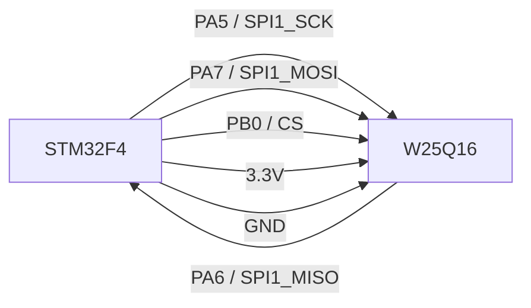

# W25Q16-Library-for-STM32

## W25Q16 SPI1 Connection



## How to install lib to your project

+ Step 1: Download 2 file "dht11.c" and "dht11.h"
+ Step 2: Click right mouse to "Application/User/Core" in Keil C, then click to "Add Existing File To ..."


+ Step 3: Choose 2 file your download. 

## How to use
+ Step 1: Adjust STM32 series if you don't use STM32F4
In file W25Q16.h, you uncomment series you use
```c
//#include "stm32f1xx.h"
//#include "stm32f2xx.h"
#include "stm32f4xx.h"
```

+ Step 2: You include library, then initialize SPI1 and use
```c
SPI1_Init();
```

+ Step 3:You can erase sector or block or chip by functions
```c
W25Q16_EraseSector(uint32_t address);
W25Q16_EraseBlock(uint32_t address);
W25Q16_ChipErase();
```

+ Step 4: You can write data such as a byte, interger number, Float number or string by
```c
W25Q16_Write(uint32_t address, uint8_t *buffer, uint32_t length);
W25Q16_WriteByte(uint32_t address, uint8_t data);
W25Q16_WriteFloat(uint32_t address,float data);
```

+ Step 5: You can read data in chip by
```c
W25Q16_ReadData(uint32_t address, uint8_t *buffer, uint32_t length);
W25Q16_ReadByte(uint32_t address);
W25Q16_ReadFloat(uint32_t address);
```
